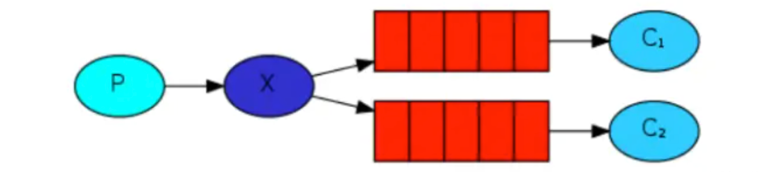

# RabbitMQ - 发布/订阅模式

在发布/订阅模式中，多了一个交换机角色;

P：生产者，不再将消息直接发送到队列中，而是发送到交换机中，通过交换机转发到队列中  
X: 交换机, 接收消息，转发消息或者丢弃消息  
交换机有常见的3种类型

- direct: 定向，指定将消息发送到对应的routing key的队列
- topic: 主题/通配符，将消息发送到routing key匹配的对应的队列
- fanout: 多播，将消息发送到所有绑定交换机对应的队列

Queue: 队列   
C1/C2: 消费者

